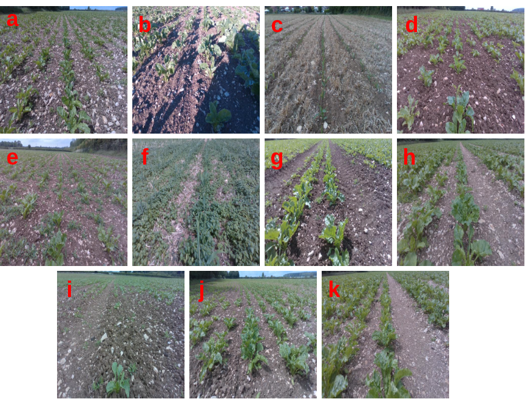
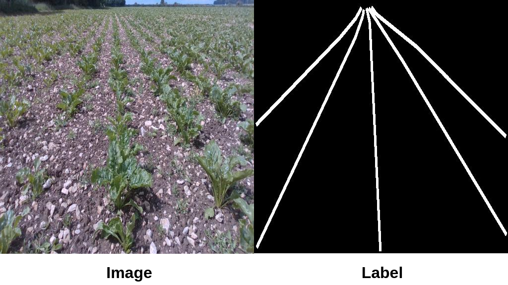

# CropRow Detection Lincoln Dataset (CRDLD)

Here we will release the version 2.1 of CRDLD dataset. [Click here for version 1.0.](https://github.com/JunfengGaolab/CropRowDetection/tree/CRDLDv1) 

---
## Dataset Structure
The dataset is based on 2000 images. The 2000 image dataset is classified into three groups for the purpose of training, testing and validation. The training, testing and validation sub-groups contain 1250,500 and 250 images respectively. Each image in the dataset consists of a corresponding ground truth image. Numeric values of the labelled coordinates are stored in *.mat* files. 

    .
    │
    ├── Train Dataset              # 1250 images and ground truth segmentations from 50 data classes. [25 Images per class x 50 Classes]
    |   └──labels.mat             # .mat file containing image label coordinates for 1250 images
    │
    ├── Test Dataset               # 500 images and ground truth segmentations from 50 data classes. [10 Images per class x 50 Classes]
    |    └──Labels                  # .mat file containing image label coordinates for 500 images
    │
    └── Test Dataset               # 250 images and ground truth segmentations from CRDLDv1.0 base images.
        └──Labels                  # .mat file containing image label coordinates for 250 images

## Table 1: Data Categories
Table 1 contains the different field variations represented in the dataset.

| **ID** | **Data Category** | **Description** |
|--------|-------------------|-----------------|
| a      | Horizontal Shadow | Shadow falls perpendicular to the direction of the crop row |
| b      | Front Shadow      | Shadow of the robot falling on the image captured by the camera |
| c      | Small Crops       | Crop rows at early growth stages (Up to 4 unfolded leaves) |
| d      | Large Crops       | Presence of one or many largely grown crops (more than 4 unfolded leaves) within the crop row |
| e      | Sparse Weed       | Sparsely grown weed scattered between the crop rows |
| f      | Dense Weed        | Weed grown densely among the crop rows where the inter-row space is completely covered |
| g      | Sunny             | Crop row data captured in sunny weather |
| h      | Cloudy            | Crop row data captured in cloudy weather |
| i      | Discontinuities   | Missing plants in the crop row which lead to discontinuities in crop row |
| j      | Slope/ Curve      | Images captured while the crop row is not in a flat farmland or where crop rows are not straight lines |
| k      | Tyre Tracks       | Tyre tracks from tramlines running through the field |

<figure>
  
  <figcaption>Figure 1: Example images from data categories in Table 1. </figcaption>
</figure>

## Table 2: Data Classes Formed by Combinations of Field Variations
Table 2 contains the combinations field variations given in Table 1 in the dataset.

| Data Category      | a | b | c      | d     | e | f | g | h | i | j |
|--------------------|---|---|--------|-------|---|---|---|---|---|---|
| Horizontal Shadow | 1 |   |        |       |   |   |   |   |   |   |
| Front Shadow      |   | 7 |        |       |   |   |   |   |   |   |
| Small Crops       | 2 | 8 | 11, 44 |       |47 |   |   |   |45 |46 |
| Large Crops       | 3 | 9 | 12     | 20, 48|50 |   |   |   |49 |   |
| Sparse Weed       |   |   | 13     | 21    |   |   |   |   |   |   |
| Dense Weed        |   |   | 14     | 22    |   |   |   |   |   |   |
| Sunny             |   |   | 15     | 23    |28 |32 |   |   |   |   |
| Cloudy            |   |   | 16     | 24    |29 |33 |   |   |   |   |
| Discontinuities   | 4 | 10| 17     | 25    |30 |34 |36 |39 |   |   |
| Slope/ Curve      | 5 |   | 18     | 26    |31 |35 |37 |40 |42 |   |
| Tyre Tracks       | 6 |   | 19     | 27    |   |   |38 |41 |43 |   |


## Sample Data
The crop row is labelled with white lines on black background. The line width of the white line is 6 pixels. The labels could be regenerated with custom line width using the labels *.mat* files.

<figure>
  
  <figcaption>Figure 2: Example image and semantic label from the dataset. </figcaption>
</figure>


## Citation

```
@article{de2022deep,
  title={Deep learning-based Crop Row Following for Infield Navigation of Agri-Robots},
  author={de Silva, Rajitha and Cielniak, Grzegorz and Wang, Gang and Gao, Junfeng},
  journal={Journal of Field Robotics},
  year={2023}
}
```
